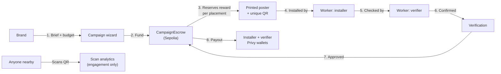
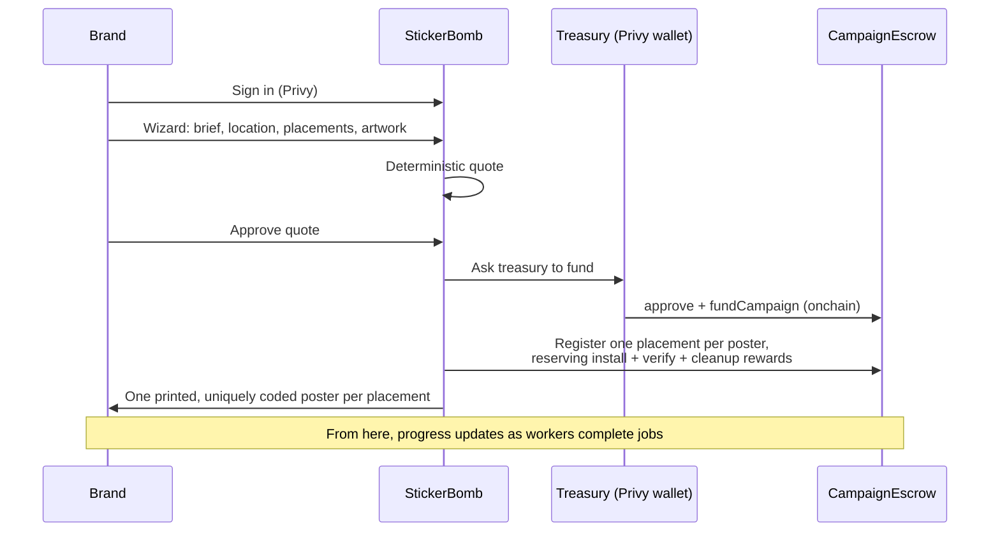
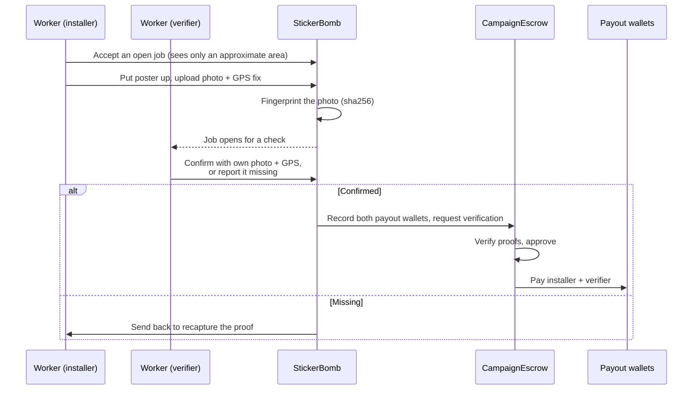

# StickerBomb

StickerBomb turns a brand campaign brief into a persistent, measurable physical
campaign: real posters at real locations, put up and independently checked by
real people, paid automatically the moment a check is confirmed — all funded
and settled onchain.

Put simply: a brand types up what they want plastered around town and pays
into the app, no crypto knowledge needed. Anyone else — literally anyone with
a phone, no special skills or gear — can open the worker app, grab a nearby
job, stick up a poster, snap a photo, and get paid in minutes once someone
else confirms it's really there. You don't need to be a marketer or a
blockchain person to run a campaign, and you don't need to be a courier
company to go put posters up and earn from it.

## The idea, in one picture



A brand never touches a wallet, and a worker never touches a brand's money
directly — everything in between is a contract rule or a Privy-managed wallet,
not a person with a private key.

## The two people who use it

**A brand** signs in, describes a campaign (what, where, how many posters,
budget), and funds it from a company treasury. From there they just watch
progress: which posters are up, which are verified, and where the money went.

**A worker** opens the PWA on their phone, picks a nearby open job, walks over,
puts the poster up, and photographs it with their GPS location attached. A
second worker then confirms it's really there. The moment that check is
confirmed, both roles get paid, onchain, automatically.

Whether the installer may take that check themselves is a deployment setting
(`ALLOW_SELF_VERIFICATION`, see [Verification settings](#verification-settings)).
Set it to `false` and the two roles must be different people.

## Brand flow, step by step



Large fundings can require a **second brand member's approval** before the
treasury moves money — set on the Treasury page.

## Worker flow, step by step



The installer never sees who checks their work. Whether they can take the
check themselves is controlled by `ALLOW_SELF_VERIFICATION`; with it off, the
server refuses the accept and the two roles must be distinct people.

## What each piece is for

| Layer | What it does | Why it exists |
| --- | --- | --- |
| **Privy** | Sign-in, and a server-side wallet per brand ("the treasury") that only StickerBomb's server can drive, under a policy that restricts it to funding campaigns | So a brand doesn't need a crypto wallet, and no employee ever holds a key that could move the treasury's funds elsewhere |
| **CampaignEscrow (Sepolia)** | Holds a campaign's budget, reserves per-placement rewards, and pays workers only on an approved verification | So the money rules (who can fund, who can get paid, what a placement is worth) are guaranteed by a contract, not just app logic |
| **Verification** | Checks that a poster's proof is genuine — right location, right QR, a fresh photo, no reused media — before approving payout | So payment reflects real, confirmed work rather than a self-reported "done" |
| **Worker PWA (`/worker`)** | An installable phone app for accepting jobs, uploading proof photos with GPS, and running independent checks | Installing and checking posters happens in the field, from a phone, not a desk |
| **Scan analytics** | Counts and de-duplicates QR scans from the public, without ever storing who scanned | Engagement data for the brand — it never proves installation and never triggers a payout |

Full contract addresses and the lower-level design of the escrow and the
verification workflow: **[docs/onchain-brand-flow.md](docs/onchain-brand-flow.md)**.

## Tech stack

| Area | What's used |
| --- | --- |
| App | Next.js 15 (App Router), React, TypeScript |
| Database | Prisma 7 ORM over Supabase Postgres |
| Auth & wallets | Privy — sign-in, and a server wallet per brand (the treasury) |
| Onchain | Foundry-built Solidity contracts (`CampaignEscrow`), deployed to Sepolia, read/written with `viem` |
| Maps | Mapbox (the wizard's animated globe, worker job locations) |
| Media | Supabase Storage (private `proofs` bucket for install/verify photos, uploaded via signed URLs) |
| Poster/QR generation | In-house renderer, including a halftone style that maps a brand's artwork onto the QR's modules |
| Verification | A deterministic rules workflow — geofence, QR match, freshness, distinct installer/verifier, no reused media — that produces the onchain payout verdict |
| Hosting | Vercel |

## Project layout

```
src/app/               Next.js routes: brand pages, worker PWA, public QR redirect, API routes
src/components/        UI: campaign wizard, poster studio, worker PWA screens, treasury pages
src/lib/                Server logic: treasury, funding, jobs, verification, quotes, chain access
contracts/              Foundry project — CampaignEscrow.sol and its tests
cre/placement-verifier/  The verification workflow and its deterministic checks
prisma/                 Schema and migrations
docs/                   Deeper design notes (onchain flow, contract addresses)
```

### Worker PWA (`/worker`)

An installable mobile app (manifest, service worker, bottom tabs) for the
people who put posters up and check them:

- **Jobs**: open placements with only an approximate area until accepted, and
  checks. The Put up and Verify tabs are separate lists; a worker sees the
  check for their own poster only when `ALLOW_SELF_VERIFICATION` is on.
- **Proof**: the phone uploads its photo straight to the private Supabase
  `proofs` bucket through a signed URL, with its GPS fix. The server stores the
  photo's sha256 as the evidence fingerprint.
- **Check**: the checker confirms with their own photo and location, or reports
  the poster missing, which sends the installer back to recapture.
- **Settlement**: a confirmed check records both Privy payout wallets in escrow
  and triggers verification; the escrow then pays both workers. **Wallet**
  shows earnings and the onchain payout.

It runs on the same placements, jobs and evidence as the Brand Portal
(`src/lib/jobs/worker-view.ts`). Development-only **demo controls**
(`NEXT_PUBLIC_DEMO_MODE=true`) on the brand campaign page step placements with
two prepared demo workers through the same code path.

The live on-camera challenge is not in the app yet: the photo is the challenge
response for now.

> Migration `20260911130000_retire_worker_dash_tables` drops the tables of an
> earlier parallel worker prototype (`placement_jobs`, `placement_proofs`,
> `ledger_entries`). Apply it with `npm run db:deploy` once their rows are
> confirmed to be test data.

## Requirements

- Node.js 20.19+, 22.12+, or 24+
- npm
- A Privy application
- A Supabase Postgres database
- A Mapbox account (public token)

## Local setup

1. Install dependencies:

   ```bash
   npm install
   ```

2. Copy `.env.example` to `.env` and fill in:

   ```env
   NEXT_PUBLIC_PRIVY_APP_ID=
   PRIVY_APP_SECRET=
   DATABASE_URL=
   NEXT_PUBLIC_MAPBOX_ACCESS_TOKEN=
   NEXT_PUBLIC_APP_URL=http://localhost:3000
   ```

   `PRIVY_APP_SECRET` and database credentials are server-only. Never prefix either with `NEXT_PUBLIC_`.

   The Mapbox token is public by design because the map runs in the browser. Use a `pk.` token restricted to your domains, never a secret `sk.` token.

   `NEXT_PUBLIC_APP_URL` is embedded in every printed QR code. Set it to a stable address before generating assets you intend to print.

3. Apply database migrations and seed approved locations:

   ```bash
   npm run db:migrate
   npm run db:seed
   ```

   When `DATABASE_URL` points to the Supabase transaction pooler on port `6543`, the Prisma CLI automatically uses its session-pooler equivalent on port `5432`. You can instead provide an explicit `DIRECT_URL`.

   The seed creates permissioned demo surfaces across eight cities and is safe to re-run:

   | City | Surfaces | Districts |
   | --- | --- | --- |
   | New York | 6 | Financial District, Tribeca, Battery Park, Civic Center |
   | Pune | 7 | Koregaon Park, Kalyani Nagar, Viman Nagar, Shivaji Nagar, Baner, Hinjewadi |
   | Cape Town | 12 | City Bowl, Woodstock, Salt River, Observatory, Green Point, Sea Point, V&A Waterfront, Gardens, Camps Bay, Claremont |
   | New Delhi | 8 | Connaught Place, Khan Market, Hauz Khas, Saket, Lajpat Nagar, Nehru Place, Rajouri Garden, Chandni Chowk |
   | Bengaluru | 9 | HSR Layout, Koramangala, Indiranagar, BTM Layout |
   | Mumbai | 8 | Bandra West, Lower Parel, Colaba, Powai, Andheri West, Bandra Kurla Complex, Kala Ghoda |
   | Jalgaon | 1 | MJ College |

   Surfaces are spread across districts on purpose, so targeting several areas in
   one city reaches more inventory than widening a single radius.

4. Start the application:

   ```bash
   npm run dev
   ```

5. Open `http://localhost:3000`, sign in, create a brand workspace, then run the wizard.

## Routes

| Route | Purpose |
| --- | --- |
| `/` | Application entry, membership resolution and brand onboarding |
| `/brand` | Campaign dashboard |
| `/brand/new` | Five-step campaign wizard, opened as a popup over the dashboard |
| `/brand/campaigns/[id]` | Campaign details, escrow balances and placement progress |
| `/brand/placements` | Placement tracking across all campaigns |
| `/brand/payments` | Treasury: Privy wallet, policy, approvals and onchain activity |
| `/brand/analytics` | Live per-asset scan attribution |
| `/worker` | Worker Portal placeholder (Phase 3) |
| `/s/[code]` | Public QR redirect and scan attribution |

### API

| Endpoint | Purpose |
| --- | --- |
| `/api/me` | Authenticated identity and nullable organization membership |
| `/api/onboarding/brand` | Explicit, idempotent brand-workspace onboarding |
| `/api/campaigns` | List and create campaigns |
| `/api/campaigns/[id]` | Read and update an owned campaign |
| `/api/locations/available` | Approved locations within a centre and radius |
| `/api/campaigns/[id]/locations` | Read and replace the assigned locations |
| `/api/campaigns/[id]/quote` | Read or recompute the deterministic quote |
| `/api/campaigns/[id]/quote/approve` | Approve the current quote |
| `/api/campaigns/[id]/fund` | Fund from the Privy treasury into escrow, then issue assets |
| `/api/campaigns/[id]/escrow` | Live escrow balances (GET) and chain sync (POST) |
| `/api/campaigns/[id]/placements` | Placement progress for one campaign |
| `/api/campaigns/[id]/demo` | Development-only demo controls |
| `/api/treasury` | Treasury wallet, policy, balances and history |
| `/api/treasury/top-up` | Testnet only: mint demo tUSDC into the treasury |
| `/api/treasury/settings` | Second-approver threshold |
| `/api/funding-requests/[id]/approve` | A second member approves and the treasury funds |
| `/api/jobs/nearby`, `/api/jobs/[id]/accept`, `/api/jobs/[id]/start` | Worker job APIs |
| `/api/cre/placements/[id]/evidence` | Exact evidence for verification only (secret-authenticated) |
| `/api/cre/placements/[id]/verdict` | Verdict callback that settles a placement |
| `/api/campaigns/[id]/assets` | List generated assets |
| `/api/campaigns/[id]/assets/generate` | Generate one coded poster per placement |
| `/api/campaigns/[id]/assets/[code]/image` | Render a printable poster |
| `/api/analytics` | Scan analytics across the organization |
| `/api/campaigns/[id]/analytics` | Scan analytics for one campaign |

## Commands

```bash
npm run dev              # Turbopack
npm run dev:webpack      # webpack, for parity checks
npm run typecheck
npm run build            # webpack
npm run build:turbopack  # faster, but currently ships much more JS
npm run db:generate
npm run db:migrate
npm run db:seed
npm run db:deploy
npm run db:studio
npm run contracts:test   # Foundry tests for CampaignEscrow
npm run cre:test         # Bun tests for the verification checks
npm run e2e:sepolia      # full treasury → escrow → verification → payout run on Sepolia
npm run e2e:worker       # Worker PWA flow: photo proof, independent check, payout
```

Development runs on Turbopack: it starts in roughly half the time and compiles
routes faster. Production builds stay on webpack deliberately — a Turbopack build
is about twice as fast but currently emits a far larger shared bundle (842 kB of
shared first-load JS against 105 kB), so it is opt-in via `build:turbopack`.

Turbopack ignores the `webpack()` hook in `next.config.ts`, so any bundler
aliases must be declared in both places. Unused optional peer dependencies are
listed once in `unusedOptionalModules` and applied to each.

`next dev` and `next build` share the `.next` directory, and building while a dev server runs will break it. Set `NEXT_DIST_DIR` to build or serve from a separate directory when you need both:

```bash
NEXT_DIST_DIR=.next-verify npm run build
```

## Verification settings

Server-only environment variables that change how proof is checked. They are
deliberately not `NEXT_PUBLIC_`: whether a check is strict is not something the
browser should be able to read.

| Variable | Default | What it does |
| --- | --- | --- |
| `ALLOW_SELF_VERIFICATION` | `false` | `true` lets one account hold both the installer and verifier job for the same placement. Useful for demos and single-device testing. Set it to `false` for the real two-person rule. |
| `STICKERBOMB_LENIENT_VERIFICATION` | `false` | `true` drops the on-site dwell requirement and disables the random spot check. It does **not** relax the geofence. |
| `STICKERBOMB_SPOT_CHECK_PERCENT` | `10` | Share of placements pulled into an extra independent check after the confidential verdict approves. Ignored while lenient verification is on. |
| `STICKERBOMB_MIN_DWELL_SECONDS` | `30` | Seconds a worker must be on site before their photo counts. Forced to `0` by lenient verification. |

The geofence is a fixed 5 km in both modes, so a placement submitted from the
wrong side of a city still fails.

A self-verified placement still stops at the verifier step: the installer
submits their proof, the placement moves to `AWAITING_VERIFIER`, and the check
appears in the Worker PWA's **Verify** tab as a separate job with its own
reward. Verification is never folded into the install.

## Authorization model

Browser requests send a short-lived Privy access token. API route handlers verify it and may bootstrap only the local user record. `/api/me` resolves an existing organization membership without granting one; brand onboarding happens only through the explicit onboarding endpoint. Every campaign request independently requires an existing `BRAND` or `OPERATOR` membership and scopes database queries to that organization. Client-supplied user IDs, organization IDs and roles are never trusted.

Because the wizard saves partial drafts, the database permits incomplete campaigns. Completeness is proven at the `DRAFT → QUOTED` boundary instead, which is the only invariant that guards quoting and funding.

## Location policy

A brand chooses a campaign **area**: a country, a city and a radius. StickerBomb assigns the **exact surface** from its own approved inventory, and a worker only sees that surface after accepting the job. Only permissioned surfaces are ever used, and a venue's active-campaign limit is enforced when a campaign is funded.

## Scan analytics

Scans are engagement analytics. They never prove a poster was installed and never trigger a worker payout. Total scans and estimated unique scans are reported separately, suspected automated traffic is flagged, and visitor identity is never stored: only salted one-way hashes and a coarse region.
