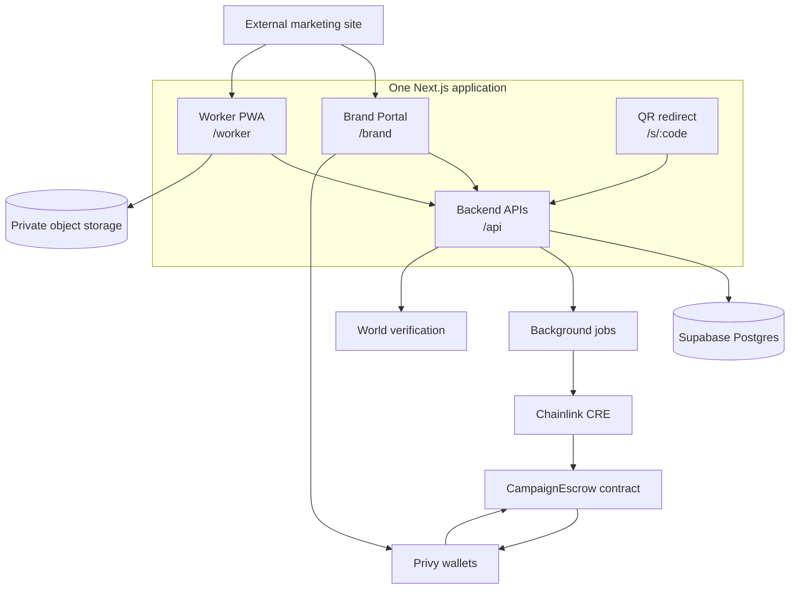

# 00 — System Architecture & Scope

<aside>
🏗️

**Architecture decision**

Build one Next.js application containing the Brand Portal and installable Worker PWA, backed by Next.js APIs, Supabase and one onchain campaign escrow. The separate marketing page remains outside this repository.

</aside>

## Product surfaces

| Surface | Route | Purpose |
| --- | --- | --- |
| Application entry | `/` | Authenticate and redirect by role |
| Brand Portal | `/brand` | Create, fund and monitor campaigns |
| Worker PWA | `/worker` | Install, verify and remove placements |
| Public QR redirect | `/s/[code]` | Record attribution and redirect visitors |
| Backend API | `/api/*` | Trusted application logic |

## System architecture



## Deployments

```
Vercel
├── Brand Portal
├── Worker PWA
├── QR redirects
└── Next.js APIs

Supabase
├── Postgres
├── private evidence bucket
├── public campaign-assets bucket
└── realtime events

Trigger.dev or equivalent
└── verification, retries and payout orchestration

EVM testnet
└── CampaignEscrow + test USDC
```

## Repository target

```
src/
├── app/
│   ├── brand/
│   ├── worker/
│   ├── s/[code]/
│   └── api/
├── components/
│   ├── brand/
│   ├── worker/
│   └── shared/
├── lib/
│   ├── auth/
│   ├── database/
│   ├── storage/
│   ├── qr/
│   ├── chainlink/
│   ├── privy/
│   └── world/
└── types/

contracts/
├── CampaignEscrow.sol
└── test/
```

## Onchain boundary

### Onchain

- Campaign funding
- Installer, verifier and cleanup rewards
- Cleanup reserve
- Worker payout wallets
- Evidence commitment
- Final verification status
- Payout and refund events

### Offchain

- Brand conversation and artwork
- Exact GPS coordinates
- Raw installation and verifier videos
- Selfie data
- Worker routes
- QR scan events and visitor analytics
- Printer and courier operations

> Money, commitments and verification receipts go onchain. Sensitive evidence and high-volume application data stay offchain.
> 

## Sponsor roles

```
World
→ confirms a live participant and supports abuse controls

Chainlink CRE
→ evaluates exact location and raw evidence confidentially

Privy
→ authenticates users, creates wallets and funds/pays milestones

CampaignEscrow
→ guarantees the campaign budget and payment rules
```

## Hackathon scope

### Build

- Persistent brand campaigns
- Deterministic quote
- Three unique printable QR assets
- Fast redirects and live scan analytics
- Worker PWA
- One installer and one independent verifier flow
- Private evidence upload
- One onchain escrow contract
- Real testnet funding and payouts
- World and Chainlink sponsor paths
- Cleanup reserve

### Do not build

- Marketing website
- Full admin portal
- Production printer marketplace
- Courier automation
- Multi-chain deployment
- Native mobile application
- Token economics
- Pay-per-scan rewards
- Complex arbitration

## Technical rules

1. Verify Privy access tokens on the server.
2. Store currency as integer token units.
3. Upload videos directly to private storage.
4. Never expose exact GPS or raw evidence publicly.
5. Make verification and payout jobs idempotent.
6. Use contract events as the financial source of truth.
7. Reveal exact placement details only after job acceptance.
8. Require a different authenticated participant for verification.
9. Keep public QR redirects independent from slow verification systems.
10. Use only permissioned physical locations.