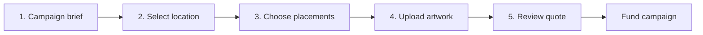

# Phase 2 — Brand Flow, QR Assets & Live Attribution

<aside>
2️⃣

**Goal:** Complete the brand-side product, make campaign location an explicit structured choice, and make every physical asset uniquely measurable.

**Exit condition:** One campaign is created through the location wizard, produces three printable QR assets, and each redirects correctly and reports separately in live analytics.

</aside>

## Product outcome

A brand can move from sentence to funded-ready campaign pack without managing individual workers:

```
Campaign brief
→ country and city selection
→ campaign area and approved locations
→ artwork upload
→ deterministic quote
→ three unique assets
→ printable pack
→ dynamic destination
→ live scan attribution
```

## Scope amendment

Phase 2 originally began at the quote. It now also owns **geography**, which no earlier phase designed. Phase 1 listed a `locations` table but never specified it, and Phase 3 assumed approved locations already existed. Campaign area cannot remain a free-text string if workers are to be dispatched to real surfaces.

Campaign creation therefore becomes a five-step wizard rather than a single modal:



### Funding boundary

Real escrow is Phase 4. Phase 2 ends at an explicitly mocked funding action that moves the campaign to `FUNDED`. The wizard must never depend on onchain work to complete, and the mock must be visibly labelled so it is not mistaken for a real payment.

### Settled decisions

| Decision | Resolution |
| --- | --- |
| Draft persistence | Campaign draft columns become nullable; completeness is enforced by validation at the `DRAFT → QUOTED` transition, not by the database |
| Free-text `area` | Becomes a generated human label derived from structured geography; never read as source of truth |
| Location inventory | Any city is selectable, cities holding inventory are highlighted, and continuing requires at least one available approved location |
| Navigation | Brand Portal is Campaigns, Placements, Payments, Analytics; New Campaign is a button. Placements and Payments are honest scoped shells until Phases 3 and 4 |
| Map access | A URL-restricted public Mapbox token, with one reused map instance across the globe and city steps |

Because the database no longer guarantees a campaign is complete, the validation at the quote boundary is the only remaining invariant. Treat it as a trust boundary, not a convenience.

## Work package A — Campaign geography and approved locations

Structured geography replaces the free-text `area` field.

- [ ]  Make campaign draft columns nullable so a wizard can save after every step.
- [ ]  Add structured geography: country code, country name, city, centre latitude, centre longitude, radius in metres.
- [ ]  Rename `area` to a generated label and preserve existing rows.
- [ ]  Add a location strategy: automatic approved selection or manual brand selection.
- [ ]  Create the `locations` table and a campaign-to-location join.
- [ ]  Record which side chose each location, brand or system.
- [ ]  Seed six approved demo locations.

### Location record

```
id
venue_name
country_code
country_name
city
latitude
longitude
surface_photo_url
placement_instructions
permission_status
max_active_campaigns
created_at
updated_at
```

### Seeded approved locations

```
1. Event entrance board
2. Sponsor booth
3. Coworking noticeboard
4. Café window
5. Community board
6. Team demo table
```

### Exact location policy

Two distinct concepts, and they must not be conflated:

| Concept | Owner | Example |
| --- | --- | --- |
| Campaign area | Brand | New York, Lower Manhattan, 1.5 km around a venue |
| Exact placement point | StickerBomb | Café Terra, approved board beside the entrance |

The brand chooses the area. The system assigns exact points from approved locations. Exact points are revealed to a worker only after job acceptance, per the Phase 3 rules.

Coordinates are stored as double precision. PostGIS is not required for Phase 2; distance filtering uses a haversine expression against the campaign centre.

## Work package B — Brand Portal navigation

```
Campaigns
Placements
Payments
Analytics
```

- [ ]  New Campaign is a button, not a navigation item.
- [ ]  Placements and Payments state which phase delivers them instead of rendering broken empty tables.
- [ ]  Replace the legacy `/analytics` redirect with a real Analytics page.
- [ ]  There is no admin dashboard in any phase.

## Work package C — Location wizard

One page with a step parameter is sufficient for the hackathon:

```
/brand/new?step=brief
/brand/new?step=location
/brand/new?step=placements
/brand/new?step=creative
/brand/new?step=review
```

- [ ]  Use a full-screen layout and hide the brand sidebar while the wizard is open.
- [ ]  Persist the campaign after every step so a brand can leave and resume.
- [ ]  Extend brief extraction to detect country and city, and keep every value correctable.
- [ ]  Render a slowly rotating globe that stops when the user interacts.
- [ ]  Support country, city and venue search.
- [ ]  Animate a single map instance from globe to city detail rather than mounting two maps.
- [ ]  Offer campaign area by radius, neighbourhood, venue category, manual selection, or automatic selection.
- [ ]  Show campaign centre, coverage circle, approved pins, available location count, estimated local fulfilment and estimated deployment time.
- [ ]  Block continuing when no approved location is available, and say so plainly.

### Map technology

Use Mapbox GL JS with its native globe projection rather than adding a separate globe library. The same instance becomes the detailed city map as it zooms. Load it client-side only.

```tsx
map.flyTo({
  center: [-74.006, 40.7128],
  zoom: 11,
  pitch: 35,
  duration: 2500,
});
```

The access token is public by definition and must be restricted to deployed domains and local development. Map loads are metered, which is a further reason to reuse one instance across steps.

### Persisted wizard data

```json
{
  "countryCode": "US",
  "countryName": "United States",
  "city": "New York",
  "centerLatitude": 40.7128,
  "centerLongitude": -74.006,
  "radiusMeters": 1500,
  "placementCount": 3,
  "locationStrategy": "AUTO_APPROVED",
  "selectedLocationIds": [],
  "deadline": "2026-09-11T18:00:00Z"
}
```

## Work package D — Deterministic quote engine

Do not use an LLM to invent prices. Use clear functions and configurable rates.

```
total = printCost
      + handoffCost
      + installerRewards
      + verifierRewards
      + cleanupReserve
      + platformFee
      + contingency
```

Example:

| Item | Amount |
| --- | --- |
| Printing | $9 |
| Installer | $18 |
| Verifier | $12 |
| Cleanup reserve | $6 |
| Platform fee | $10 |
| Contingency | $5 |
| **Total** | **$60** |

Store quote line items individually. The approved quote becomes immutable after funding; later changes require a new quote version.

### Quote API

```
POST /api/campaigns/:id/quote
POST /api/campaigns/:id/quote/approve
```

## Work package E — Artwork and asset pipeline

- [ ]  Create a public artwork bucket and private original bucket.
- [ ]  Upload one campaign artwork file.
- [ ]  Generate one asset record per placement.
- [ ]  Generate cryptographically random short codes.
- [ ]  Encode `APP_URL/s/{code}` inside each QR.
- [ ]  Composite the QR into the supplied artwork.
- [ ]  Generate printable PNG assets.
- [ ]  Generate one campaign print-manifest PDF or ZIP.
- [ ]  Verify every generated QR using a second decoder before marking it ready.

### Asset record

```
id
campaign_id
short_code
artwork_hash
qr_payload
rendered_asset_url
version
destination_url
status
created_at
```

### QR requirements

- Keep adequate quiet zone.
- Use high error correction.
- Avoid excessive halftone distortion in the MVP.
- Produce a plain high-contrast fallback asset.
- Test from at least three physical distances.

The visual QR generator is valuable campaign UX, but reliable scanning is more important than artistic complexity.

## Work package F — Dynamic redirect service

Implement:

```
GET /s/:shortCode
```

Flow:

```
Resolve asset
→ reject disabled or unknown code
→ create privacy-safe scan event
→ return fast redirect to current destination
```

Keep this route fast. Do not wait for AI, blockchain or analytics aggregation before redirecting.

### Scan data

```
id
asset_id
campaign_id
timestamp
referrer
user_agent_hash
privacy_safe_session_hash
coarse_region
is_suspected_bot
```

Do not store unnecessary public visitor identity.

## Work package G — Scan fraud controls

For the MVP:

- Rate-limit repeated requests from one session.
- Separate total scans from estimated unique scans.
- Flag datacenter user agents and obvious automation.
- Never release worker payments based on raw scan count.
- Treat scans as engagement analytics, not proof of installation.

## Work package H — Brand campaign page

Build `/brand/campaigns/[id]` with:

1. Campaign brief
2. Quote and budget state
3. Asset gallery
4. Download print pack
5. Placement progress
6. Scan totals
7. Scans by physical asset
8. Campaign destination editor
9. Payment and cleanup placeholders

Reuse the existing chart components, but replace `src/lib/mock.ts` with server-loaded data.[[1]](https://github.com/harshalbhangale/ethonline2026/blob/main/src/components/Charts.tsx)

## Work package I — Live updates

Use Supabase Realtime or short polling for:

- New scans
- Asset status
- Placement status
- Campaign timeline

The demo requirement is simple:

```
Judge scans Asset #2
→ phone opens brand destination
→ Asset #2 count increases on laptop
```

## APIs

```
GET   /api/locations/available
PATCH /api/campaigns/:id
POST  /api/campaigns/:id/locations
POST  /api/campaigns/:id/quote
POST  /api/campaigns/:id/quote/approve
POST  /api/campaigns/:id/fund
POST  /api/campaigns/:id/artwork
POST  /api/campaigns/:id/assets/generate
GET   /api/campaigns/:id/assets
GET   /api/campaigns/:id/analytics
PATCH /api/campaigns/:id/destination
GET   /s/:shortCode
```

Available-location queries accept a centre and radius and return only approved locations that are under their maximum active campaign limit. `POST /api/campaigns/:id/fund` is the mocked Phase 2 funding action and is replaced by real escrow in Phase 4.

## Tests

- [ ]  A partially completed wizard draft saves and resumes without inventing values.
- [ ]  A campaign cannot reach `QUOTED` while any required field is missing.
- [ ]  Selecting a city with no approved locations blocks continuation with a clear message.
- [ ]  Location assignment never exceeds a venue's maximum active campaigns.
- [ ]  A brand cannot attach another organization's campaign to a location.
- [ ]  The quote recalculates when placement count changes and is immutable after funding.
- [ ]  Every asset receives a different short code.
- [ ]  Every generated QR decodes to its intended URL.
- [ ]  Disabled assets do not redirect.
- [ ]  Changing the destination does not require reprinting.
- [ ]  Two scans of different assets appear separately.
- [ ]  A scan never causes a worker payout.
- [ ]  Redirect remains usable when analytics insertion temporarily fails.
- [ ]  The map bundle never loads during server rendering.

## Suggested ownership

| Owner | Responsibility |
| --- | --- |
| Brand frontend | Wizard, globe and city map, asset gallery and campaign dashboard |
| Backend | Geography schema, location inventory, quote engine, asset records and redirect route |
| Creative/frontend | QR composition and printable export |
| Product/demo | Approved location seeding, venue permission records and physical rehearsal |
| QA | Physical-device scan testing |

## Build order

Location work is visually valuable but the scan demo is what proves the product is real. Do not let the globe consume the asset pipeline's time.

```
Schema and seed
→ navigation
→ wizard shell and brief
→ globe
→ campaign area and inventory
→ quote
→ artwork, QR assets and redirect
→ review, mocked funding and analytics
```

If the schedule tightens, cut the mock-wall artwork preview, walking-distance estimates, manual location selection, the combined print manifest, and Realtime in favour of polling.

## Exit test

```
Create one campaign through the wizard
→ detect country and city from the brief
→ select a city on the globe and fly into it
→ choose a campaign radius and confirm approved locations
→ upload artwork
→ approve the deterministic quote
→ complete mocked funding
→ generate three different printable assets
→ scan all three from a phone
→ confirm one destination and three separate analytics rows
→ update destination
→ scan again without reprinting
```