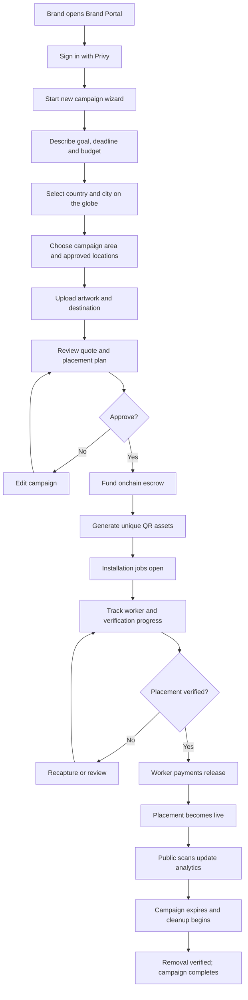
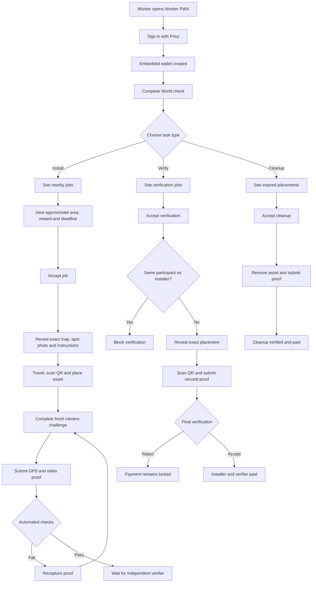
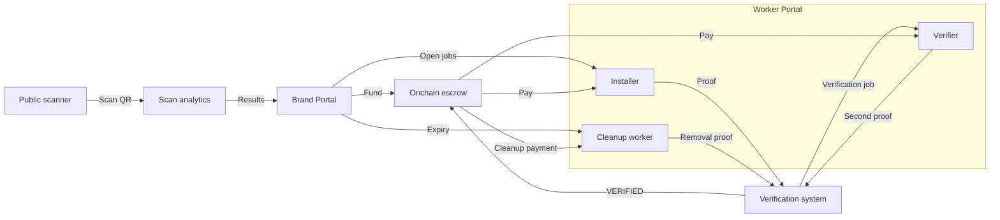

# 06 — Portal User Journeys & Diagrams

<aside>
🗺️

**Two portals, one system**

The Brand Portal creates, funds and monitors campaigns. The Worker Portal lets installers, verifiers and cleanup workers complete paid physical tasks. Public visitors only interact with a fast QR redirect.

</aside>

## Brand Portal

### Routes

```
/brand                    Campaigns
/brand/placements         Placement tracking
/brand/payments           Funding and payouts
/brand/analytics          Scan attribution
/brand/new                Full-screen campaign wizard
/brand/campaigns/[id]
```

Navigation is Campaigns, Placements, Payments and Analytics. New Campaign is a button that opens the wizard, not a navigation item. There is no admin dashboard.

### Journey



### In simple words

1. Brand signs in.
2. Brand describes the campaign in one sentence and corrects the detected values.
3. Brand selects a country and city on the animated globe.
4. Brand chooses the campaign area; StickerBomb proposes approved locations.
5. Brand uploads artwork and destination URL.
6. StickerBomb calculates the deterministic quote.
7. Brand approves and funds the campaign.
8. Unique QR assets are created.
9. Workers install and verify the placements.
10. Verified work releases payments.
11. Public scans appear in analytics.
12. Cleanup is completed from the reserved budget.

### Brand campaign page

- Brief and approved quote
- Funding transaction
- QR asset gallery
- Placement map
- Installation and verification timeline
- Evidence receipts
- Worker payouts
- Scans by asset
- Cleanup reserve and removal state

## Worker Portal

The Worker Portal is one PWA with four tabs:

```
Install | Verify | Cleanup | Earnings
```

### Routes

```
/worker
/worker/jobs
/worker/jobs/[id]
/worker/active/[id]
/worker/verify
/worker/cleanup
/worker/earnings
```

### Journey



### Installer journey

1. Sign in and complete the required World check.
2. View approximate job area, reward and deadline.
3. Accept a job.
4. Receive exact map, spot photo and instructions.
5. Travel to the approved location.
6. Scan the assigned asset.
7. Install it and complete a fresh challenge.
8. Upload location and video proof.
9. Wait for automated checks and independent verification.
10. Receive payment after final acceptance.

### Verifier journey

1. Open the Verify tab.
2. View approximate verification jobs.
3. Accept one task.
4. Backend checks that the participant did not install it.
5. Receive the exact location.
6. Visit and scan the physical asset.
7. Complete a different challenge.
8. Submit independent evidence.
9. Final verification compares both proofs.
10. Accepted verification releases installer and verifier payments.

### Cleanup journey

1. Campaign expires.
2. Removal job appears.
3. Worker accepts and receives the exact location.
4. Worker scans and removes the asset.
5. Worker records the cleared surface.
6. Verified removal releases the reserved cleanup reward.

## Portal connection



## Public QR journey

```
Scan bomb.wtf/a8k2
→ identify the physical asset
→ record privacy-safe attribution
→ update brand analytics
→ redirect to the brand destination
```

The visitor needs no account and does not install the Worker PWA. Raw scan counts never trigger worker payments.