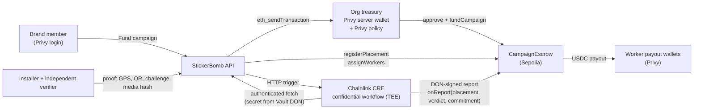

# Onchain brand flow: Privy treasury, CampaignEscrow and Chainlink CRE

StickerBomb lets a brand fund a physical QR campaign from a company treasury,
and pays the people who install and independently verify each poster only
after a confidential check proves the work happened, all on Sepolia.



## Deployed contracts (Sepolia, Sourcify-verified)

| Contract | Address |
| --- | --- |
| `MockUSDC` (tUSDC, 6 decimals, open mint for the demo) | [`0xa76BAd9b75814553A75BD3Db189C47fb9030549A`](https://sepolia.etherscan.io/address/0xa76BAd9b75814553A75BD3Db189C47fb9030549A) |
| `CampaignEscrow` v3 (tUSDC, default) | [`0x715892FdA434D1eB06acf9d4daD9ABB052faB2Fa`](https://sepolia.etherscan.io/address/0x715892FdA434D1eB06acf9d4daD9ABB052faB2Fa) |
| `CampaignEscrow` v2 (superseded, existing campaigns only) | [`0x1347FB54eFC0E6702637830A90974419f904b700`](https://sepolia.etherscan.io/address/0x1347FB54eFC0E6702637830A90974419f904b700) |
| `CampaignEscrow` v1 (superseded, existing campaigns only) | [`0xF422ddFE8153d625B0724d5116eb73C75EF918d0`](https://sepolia.etherscan.io/address/0xF422ddFE8153d625B0724d5116eb73C75EF918d0) |
| `CampaignEscrow` bound to Circle Sepolia USDC | [`0xD173f09A11d102E748D258e61310A3D9F2944096`](https://sepolia.etherscan.io/address/0xD173f09A11d102E748D258e61310A3D9F2944096) |
| Chainlink CRE Sepolia forwarder (trusted reporter) | `0x15fC6ae953E024d975e77382eEeC56A9101f9F88` |

Source: [`contracts/src`](../contracts/src). Addresses and deployment
transactions: [`contracts/deployments/sepolia.json`](../contracts/deployments/sepolia.json).

`CampaignEscrow` guarantees the money rules independently of the app:

- The first depositor of a campaign is its funder; only they can add to it.
- Each placement reserves installer, verifier and cleanup rewards from the
  campaign budget; reservations can never exceed the deposit.
- The installer and verifier must be different addresses (`SelfVerification`).
- Only the Chainlink CRE forwarder can deliver a verdict (`onReport`).
- An approved verdict pays the installer and verifier; a rejected verdict keeps
  the money locked so the proof can be recaptured.
- The cleanup reward stays reserved until removal is verified.
- Anything never committed can be refunded to the funder.

15 Foundry tests cover these rules: `cd contracts && forge test`.

## How Privy enables the product

Privy is the company's bank account, not only its login.

| Need | Privy feature used |
| --- | --- |
| Brand members sign in | Privy auth (email, Google, wallet); access tokens verified server-side on every API call |
| A company treasury no single employee holds keys to | One **Privy server wallet per organization**, created on first use (`wallets().create`) |
| The treasury must only ever fund campaigns | A **Privy policy** attached to the wallet (`policies().create`): on Sepolia only, the wallet may `approve` exactly the escrow as spender and call `fundCampaign` on the escrow with a per-deposit cap of 10,000 tokens. Every other transaction, transfer or signature is refused by Privy, even if StickerBomb's server were compromised. |
| Funding without wallets, gas or signing prompts | The server asks Privy to sign `approve` + `fundCampaign` (`wallets().ethereum().sendTransaction`); the operator keeps the treasury topped up with Sepolia gas |
| B2B controls | An organization **approval threshold**: funding above it creates a funding request that a *different* member must approve on the Treasury page before the treasury moves money |
| Worker payouts | Payout wallets are Privy wallets; the escrow pays them directly |

Code: [`src/lib/treasury`](../src/lib/treasury), [`src/lib/funding/service.ts`](../src/lib/funding/service.ts),
UI: **Treasury** page and the wizard's **Fund from your treasury** step.

## What the Chainlink CRE workflow keeps confidential

Workflow: [`cre/placement-verifier`](../cre/placement-verifier) (TypeScript,
`@chainlink/cre-sdk`), registered with **`handlerInTee`** behind an HTTP trigger.

Inside the enclave:

1. The Vault DON releases two secrets into the TEE: the evidence API key and a
   geofence salt.
2. The workflow calls StickerBomb's `/api/cre/placements/:id/evidence` with the
   key. The response is the sensitive part of StickerBomb: **both workers' exact
   GPS fixes, the approved surface's exact coordinates and geofence, worker
   identities, challenge responses and media fingerprints.**
3. Deterministic checks ([`checks.ts`](../cre/placement-verifier/checks.ts), 7 Bun tests):
   right QR, inside the geofence (accuracy-aware), fresh challenge, challenge
   matched, media not reused, installer ≠ verifier, both proofs present.
4. A **salted commitment** to the evidence is computed, so the public hash
   cannot be brute-forced back into coordinates.

Leaves the enclave: `approved`, reason codes and the commitment. They are
reported to the app (brand timeline) and, as a DON-signed report, written to
`CampaignEscrow.onReport`, which pays the workers.

Brands never see coordinates or worker identities: the brand API returns proof
*status* only.

## Worker PWA

Real workers reach the same settlement from their phones (`/worker`): accept a
job, upload a photo straight to private storage with a GPS fix, and an
independent checker confirms with their own photo. Confirming the check records
both Privy payout wallets in the escrow and starts the confidential CRE
verification. Photo bytes are fingerprinted (sha256) so the enclave can reject
reused photos. `npm run e2e:worker` runs this flow on Sepolia, including a
"poster missing" report and recapture.

## Running it

```bash
cp .env.example .env            # fill Privy, database, PRIVATE_KEY, CRE secrets
npm install && npm run db:deploy
npm run dev                     # NEXT_PUBLIC_DEMO_MODE=true shows demo controls
```

1. Sign in, create a campaign in the wizard popup, and on **Review** press
   **Add 500 test tUSDC**, then **Fund**. Privy signs; the escrow receives the budget.
2. On the campaign page, each placement has a **next demo step** button:
   send installer → installer proof → send independent verifier → verifier proof
   → **Run confidential verification** (Chainlink CRE, about a minute).
3. **Submit proof from the wrong place** shows the enclave rejecting the proof;
   payment stays locked until **Recapture proof** passes.

Confidential workflow on its own (with the app running on port 3000):

```bash
cd cre
cre workflow simulate ./placement-verifier --target staging-settings \
  --http-payload '{"placementId":"<placement id>"}' --broadcast
```

Full scripted run on Sepolia (app running on port 3100):

```bash
npm run e2e:sepolia
```

## Sepolia evidence

From `npm run e2e:sepolia` on 11 September 2026: organization "StickerBomb E2E
Demo", a two-placement Cape Town campaign quoted at 44.00.

| Actor | Address |
| --- | --- |
| Organization treasury (Privy server wallet, policy `w4tr3j64n2jxo7xwdcs0z86q`) | [`0x8d14f5dF0fB4C81E79267D497BE8b606F537D868`](https://sepolia.etherscan.io/address/0x8d14f5dF0fB4C81E79267D497BE8b606F537D868) |
| Demo installer payout wallet (Privy) | [`0xE8CeEc2F58FE6B529F13c8A71A6B02A705d588ce`](https://sepolia.etherscan.io/address/0xE8CeEc2F58FE6B529F13c8A71A6B02A705d588ce) |
| Demo verifier payout wallet (Privy) | [`0xBdD8418676AA0Cb9f20F83cEA04e583af5a7638b`](https://sepolia.etherscan.io/address/0xBdD8418676AA0Cb9f20F83cEA04e583af5a7638b) |

| Step | Signed by | Transaction |
| --- | --- | --- |
| 500 tUSDC test top-up of the treasury | operator | [`0xbd2278a9…a710`](https://sepolia.etherscan.io/tx/0xbd2278a9f975479ec0982c46943abefbdaafb16a3e45e2c94f79c2eebc00a710) |
| Gas top-up of the treasury | operator | [`0x005c6ac8…bec2`](https://sepolia.etherscan.io/tx/0x005c6ac81166397083e82ffb13573a8b8c076b433afcd0299b53c9fd7a94bec2) |
| Approve escrow for 44.00 tUSDC | **Privy treasury wallet** (policy-checked) | [`0x08b56b2f…2854`](https://sepolia.etherscan.io/tx/0x08b56b2f3955408c68ef1abad48083058cb288ba732411570b3d1fe333252854) |
| Fund campaign: 44.00 tUSDC into escrow | **Privy treasury wallet** (policy-checked) | [`0xb86c4b75…fb51`](https://sepolia.etherscan.io/tx/0xb86c4b75762f05ef9bf10d6e40e79da4536e2d51ae4d6fc896b0b753eee1fb51) |
| Reserve rewards, placement 1 (12.00) | operator | [`0xfba15cc4…217e`](https://sepolia.etherscan.io/tx/0xfba15cc4ae558e76fd9ad030fb480b1a629abfd98202aef7e659cf5eb15c217e) |
| Reserve rewards, placement 2 (12.00) | operator | [`0x549611d8…edea`](https://sepolia.etherscan.io/tx/0x549611d8ee17d961f165059fe4fcf9d2ce80cab504d97de2b0b6442a33e6edea) |
| Record independent installer and verifier, placement 1 | operator | [`0x0f119ee1…0319`](https://sepolia.etherscan.io/tx/0x0f119ee186c99ada3f48506e9825f681357c40fec932b6a99514952998270319) |
| **CRE verdict: approved → installer paid 6.00, verifier paid 4.00** | Chainlink CRE (DON report via forwarder) | [`0xa26b634c…3dff`](https://sepolia.etherscan.io/tx/0xa26b634ce2577d31f2e10b7ebbf4bee6d541e6e868f08e4f3d2c2b9caa1f3dff) |
| Placement 2: installer proof submitted ~2 km from the surface | — | (offchain evidence) |
| **CRE verdict: rejected (`INSTALLER:OUTSIDE_GEOFENCE`)**: `PlacementRejected`, no transfer, payment stays locked | Chainlink CRE (DON report via forwarder) | [`0x9bb5b6a8…66ea`](https://sepolia.etherscan.io/tx/0x9bb5b6a8b56ed31dbabfdfd567b37b950054a6942278c818e21c11317c2966ea) |
| Placement 2: proof recaptured at the approved surface | — | (offchain evidence) |
| **CRE verdict after recapture: approved → installer paid 6.00, verifier paid 4.00** | Chainlink CRE (DON report via forwarder) | [`0xaa76aa6c…c910`](https://sepolia.etherscan.io/tx/0xaa76aa6cbfd99c1281105557a443f489fd51d6bc29b8ed1cf2f6a29ec3c6c910) |

Escrow state after the run, read from the contract: **44.00 deposited, 20.00
paid to workers, 24.00 still held** (of which **4.00 is the cleanup reserve**,
locked until removal is verified), and **20.00 never committed**, which is
refundable to the brand.

The CRE simulator output for the approved run, including the enclave's user
logs, is in [`docs/evidence/cre-simulation-placement-approved.txt`](evidence/cre-simulation-placement-approved.txt).
